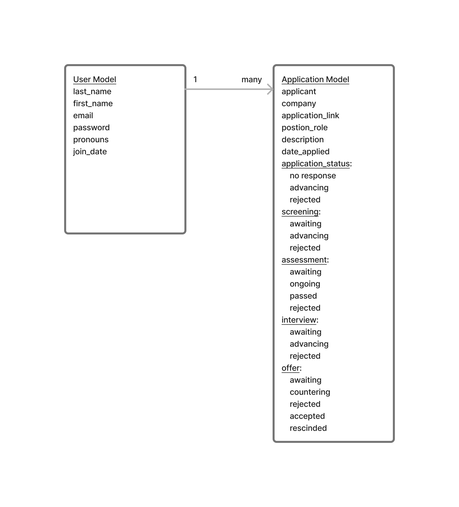
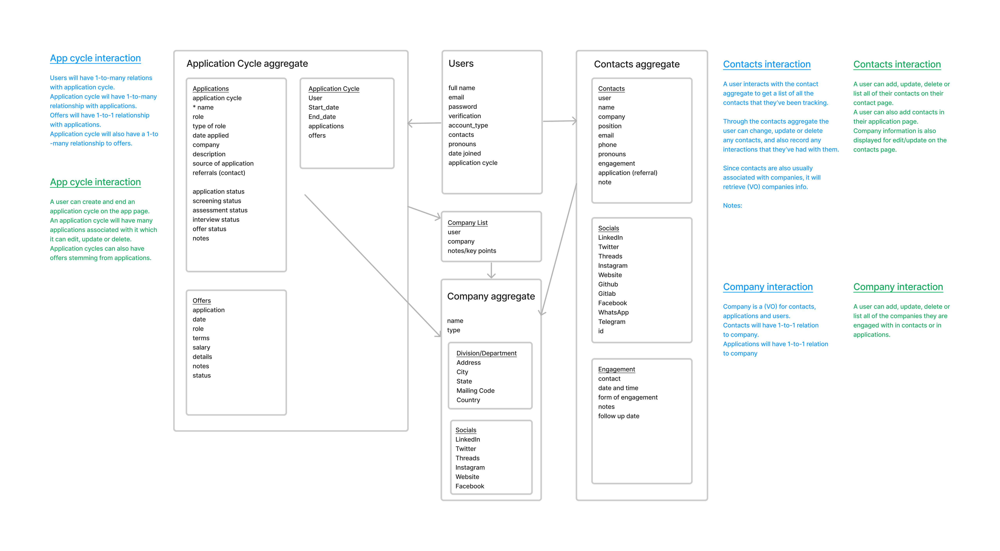

# JobFindr

A Django application project for tracking and managing activities related to a users's job search.

The initial project was created using the Django framework and utilized a simple model to serve as a minimum
viable product as proof of concept and utility.

The project is currently going through a complete revision and will be refactored in accordance with domain
driven design.  Here is the revised model as well as their relationships.

